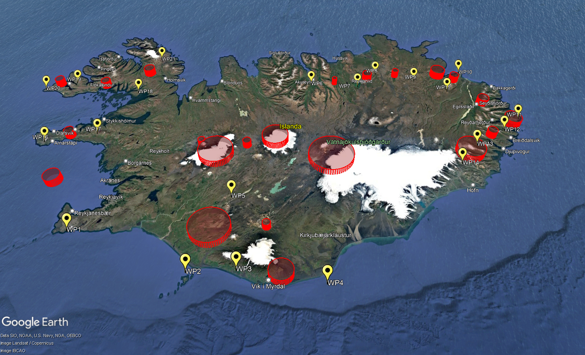
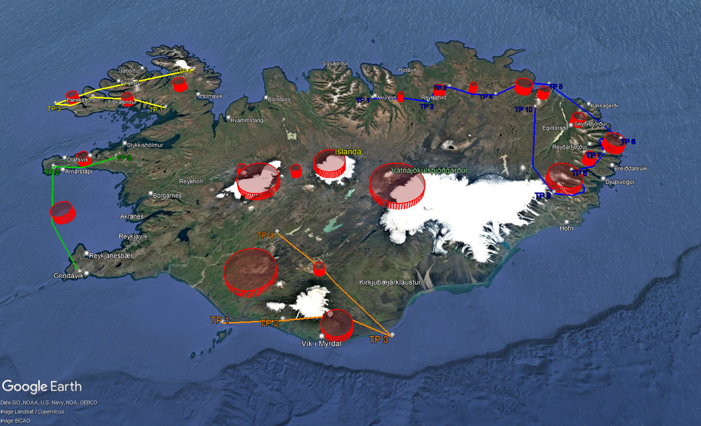

# UAV Path Planning — AMSC Project

A C++ framework for multi-objective UAV path planning in obstacle-laden environments. The system optimizes intermediate waypoints between a set of georeferenced survey targets by combining K-means clustering, TSP-based ordering, and two competing segment-level metaheuristics: classic multi-start Simulated Annealing (SA) and DRSTASA.

---

## Problem Statement

Given a set of GPS waypoints, the system computes a flyable UAV path that minimizes total length, collision risk with cylindrical obstacles (volcanic peaks, glaciers), altitude deviation, and trajectory roughness.

---

## Clone & Build

```bash
git clone https://github.com/Davidemauri8/UAVs-Path-planning-amsc.git
cd UAVs-Path-planning-amsc

mkdir build && cd build
cmake ..
make
```

Three executables are produced inside `build/`:

| Executable | Purpose |
|------------|---------|
| `testiceland` | Runs SA + DRSTASA, exports all KML / CSV files |
| `testobstacles` | Exports only the obstacle geometry to KML |
| `testbenchmark` | Three benchmark experiments (parallelization, obstacle scaling, K-scaling) |

---

### Expected console output (`testiceland`)

```
================================================================================
  UAV PATH PLANNING PIPELINE
================================================================================
1) Loaded input_iceland.csv -> 21 points loaded and converted in meters
2) Building the fitness -> Built
3) K-Means clustering (K=4) ->
4) Optimization running: SA & DRSTASA -> Completed in X.XXs

     [+] SA Raw Track      : ../output/iceland_sa.kml
     [+] DRS Raw Track     : ../output/iceland_drstasa.kml
     [+] Target Clusters   : ../output/iceland_clusters.kml
     [+] SA Full Mission   : ../output/iceland_sa_clusters.kml
     [+] DRS Full Mission  : ../output/iceland_drstasa_clusters.kml
     [+] CSV Coordinates   : ../output/iceland_clusters.csv
     [+] Overlay Compare   : ../output/iceland_comparison.kml
================================================================================
```

Open any `.kml` file in [Google Earth](https://earth.google.com/) to visualize the results.

---
## Configuration
All the configuration parameters are described in detail in the file `setup.md`.

---
## Output

Each run of `testiceland` produces the following files in `output/`:

| File | Description |
|------|-------------|
| `iceland_sa.kml` | Full SA path as a single GPS polyline |
| `iceland_drstasa.kml` | Full DRSTASA path as a single GPS polyline |
| `iceland_clusters.kml` | Survey targets coloured by cluster |
| `iceland_sa_clusters.kml` | SA paths with target markers per cluster |
| `iceland_drstasa_clusters.kml` | DRSTASA paths with target markers per cluster |
| `iceland_comparison.kml` | Side-by-side overlay of both algorithms + obstacles |
| `iceland_clusters.csv` | GPS coordinates of all waypoints (targets + intermediates) |
| `iceland_obstacles.kml` | Obstacle cylinders only (`testobstacles`) |

`testbenchmark` additionally writes `bench_parallel.csv`, `bench_obstacles.csv`, and `bench_scaling.csv`.

---

## Visual Output

### Survey targets and obstacles

The 21 GPS survey targets (WP1–WP21) cover the full island from the Reykjanes peninsula to the eastern fjords. The red cylindrical volumes are the no-fly zones corresponding to Icelandic volcanic massifs and glaciers.



---

### DRSTASA optimized paths

Optimization by DRSTASA. The population-based search explores a wider neighbourhood per segment; intermediate points differ most around dense obstacle zones.


---

## Authors

Davide Mauri and Tommaso Roncaglio
